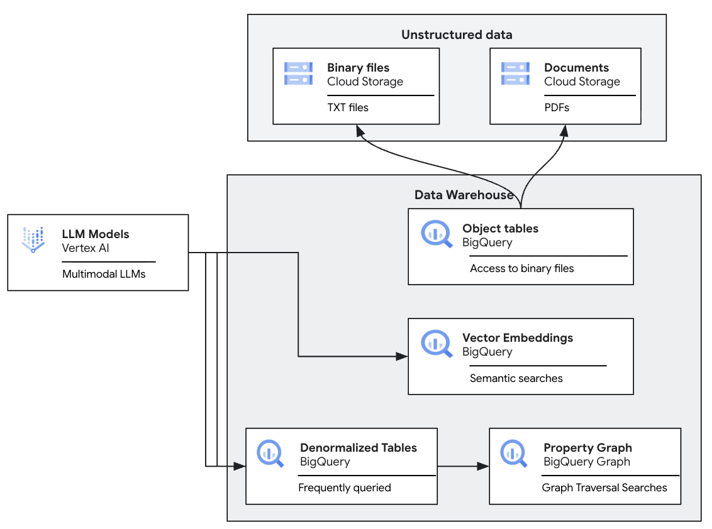

# Healthcare Document Analytics Solution: Zero-Copy RAG & Knowledge Graph

## Overview
This solution provides a comprehensive, agentic framework for analyzing healthcare documents—specifically Clinical Study Summary Reports (CSSR) and Patient Profiles—using a "Zero-Copy RAG" architecture on Google Cloud.
It leverages BigQuery as the central data and AI orchestration engine, integrating Document AI, Vertex AI (Gemini), and BigQuery Graph to transform unstructured PDF reports into a structured, searchable, and relational Knowledge Graph.

## Key Architectural Pillars: The Zero-Copy RAG
Traditional RAG (Retrieval-Augmented Generation) often requires moving data between silos (extracting text, sending to an external vector DB, then to an LLM). This solution implements **Zero-Copy RAG**, where:
1. **Data Stays in BigQuery:** PDF documents and Text files are stored in Google Cloud Storage and exposed to BigQuery via **Object Tables**.
2. **In-Warehouse Processing:**
   * **Document AI Integration:** BigQuery uses the `AI.PARSE_DOCUMENT` function to extract structured chunks and parse complex PDFs without moving the data.
   * **Generative Extraction:** `AI.GENERATE` (utilizing Gemini 2.5 models via AI Remote Connections) extracts structured entities directly from the document content.
3. **Seamless Joinery:** Extracted data is immediately joined with existing structured clinical datasets in BigQuery, creating a "Golden Record".

## 🚀 Beginner-Friendly Parameterization (New in v2.0)
To make deploying unstructured ingestion pipelines simple and scalable, we have adopted a **Two-Tier Parameterization Architecture**:

1. **Tier 1 (The Analyst):** Users only need to modify `config.yaml` to specify their Google Cloud project ID, dataset, and GCS bucket locations. No SQL or Python knowledge is required.
2. **Tier 2 (The Engine):** The `scripts/parameterize.py` script automatically ingests the YAML, performs robust escaping of BigQuery AI prompts, and generates deployable `Stored Procedures` (`Parameterized_Patient_Profiles.sql` and `Parameterized_Clinical_Trials.sql`).
These procedures can then be easily orchestrated via Cloud Run, Cloud Composer, or Airflow using `scripts/orchestrate_ingestion.py`.

### Native BigQuery AI Functions
This platform extensively utilizes the newest, native BigQuery AI functions to perform ML tasks directly within standard SQL queries without pipeline engineering:
* **`AI.PARSE_DOCUMENT`**: Performs OCR, layout analysis, and entity extraction on unstructured PDFs natively in the warehouse.
* **`AI.EMBED`**: Automatically generates high-dimensional (768-dim) vector representations of medical text (e.g., trial titles, condition descriptions).
* **`AI.GENERATE`**: Prompts Gemini 2.5 Pro and Flash directly inside `SELECT` statements to generate patient-friendly summaries, cross-trial insights, and extract structured JSON directly from text.
* **`AI.SEARCH`**: Performs both semantic (cosine vector similarity) and hybrid (vector + lexical) searches across the embedded datasets.

## Solution Components

### 1. Data Ingestion & Parsing (`sql/` & `scripts/`)
* **External Object Tables:** Unified access to PDF reports in GCS.
* **Dynamic Parameterization Engine:** `config.yaml` and `parameterize.py` generate reusable BigQuery Stored Procedures for ingestion.
* **Gemini-Powered Extraction:** High-fidelity extraction of complex clinical fields using Gemini 2.5 Pro/Flash.

### 2. Clinical Knowledge Graph (`sql/setup_clinical_trial_graph.sql`)
The solution constructs a **BigQuery Property Graph** to map the complex ecosystem of clinical research:
* **Nodes:** Trial, Drug, Disorder, Mechanism of Action (MOA), Company, Phase, Status, Criteria.
* **Relationships:**
  * `Drug` -> `MayTreat` -> `Disorder`
  * `Trial` -> `Uses` -> `Drug`

### 3. Agentic Synthetic Data Generation (`gemini-cli-plans/`)
To support development and testing, the solution includes reusable **Gemini CLI Plans** for:
* **Synthetic CSSR Generation:** Creating multi-page clinical protocols.
* **Patient Profile Generation:** Creating synthetic medical records.

### 4. Knowledge Graph Exploration (`notebooks/`)
Interactive Jupyter notebooks demonstrate querying the Property Graph using GQL (Graph Query Language) and performing semantic search.

## Prerequisites
* Google Cloud Project with BigQuery, Vertex AI, and Document AI enabled.
* BigQuery Remote Connections configured for LLM and Embedding models.
* Python 3.10+ and the `google-cloud-bigquery` library (if using the orchestration scripts).

## Quick Start
See `INSTALLATION.md` for step-by-step deployment instructions, or run `./quick-install.sh`.

## Disclaimer
**This is not an officially supported Google product.**
